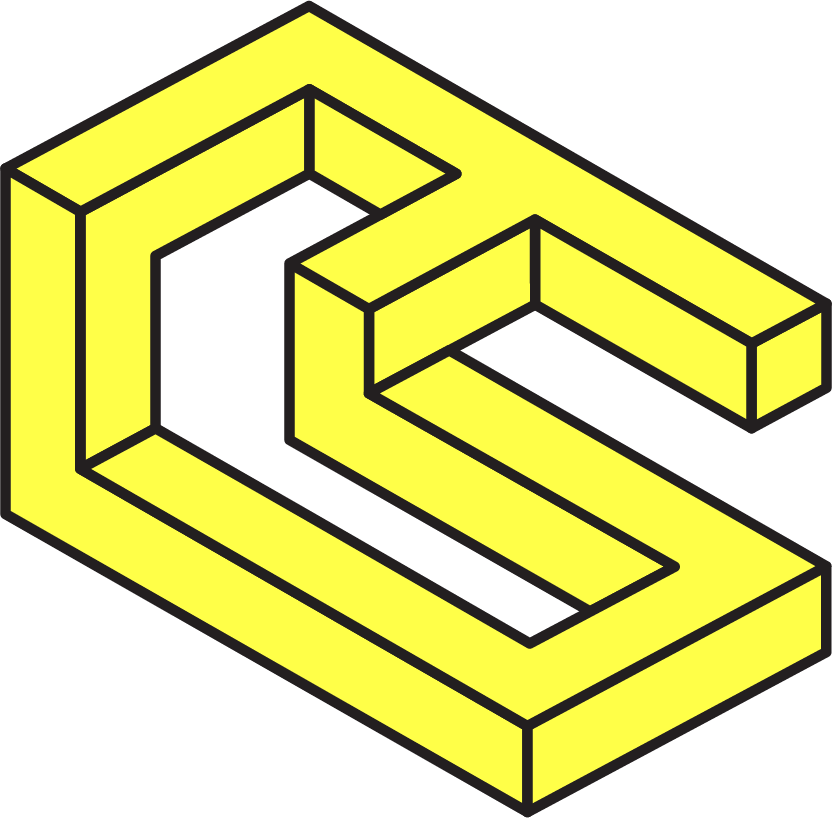

<p align="center"><a href="https://https://chainsafe.io/"></a></p>

# ChainbridgeUI

## Introduction
**Chainbridge UI** is an OpenSource (under GNU Lesser General Public License v3.0) whitelabel application for developers
to work with Chainsafe [Chainbridge](https://github.com/ChainSafe/chainbridge-core). UI consist of two part:
BridgeUI is used to interact with [Bridge](https://github.com/chainsafe/chainbridge-solidity) smart contracts
in order to send deposits.
ExplorerUI is used to track and navigate every bridging that happens over specific Bridge smart contract.

## Live demo
You can test UI with our [live demo](52.73.103.2)
This demo is a working bridge between Rinkebay <> Goerly <> Alfajores (celo).
It requires you to have MetaMask wallet and to have some ETH on those network in order to pay tx fees, also you need to request some ERC20 tokens in our [discord](https://discord.gg/ykXsJKfhgq) channel

***NOTE*** this is under an active development so can be broken occasionally.

## Running locally

For you to run our **UI** locally you need a couple of dependencies. As this is a bridge project, it needs some running parts before even using the UI in the browser.

### Requisites

Before running our bridge code you will need to have installed `golang`, `docker` and `docker-compose`. Follow the instructions here for installing those dependencies:

* golang -> [install](https://go.dev/doc/install)
* docker -> [install](https://docs.docker.com/engine/install/)
* docker-compose -> [install](https://docs.docker.com/compose/install/)

In order for your to bridge tokens from one network to another, you are going to need to clone [chainbridge-core](https://github.com/ChainSafe/chainbridge-core). This project contains everything you need to run a bridge with two `evm` networks, and all the contracts deployed. Check the [README](https://github.com/ChainSafe/chainbridge-core/blob/main/README.md) and follow the instructions to install and have everything ready.

After you cloned `chainbridge-core` you can run the following command:

```bash
make local-setup
```

This command is going to run a script that creates two evm nodes and I will run three relayers. After this is going to deploy all the contracts to the `evm` nodes. This process could take a couple of minutes to complete. After that, you are going to see something like this message:

```bash
===============================================
🎉🎉🎉 ChainBridge Successfully Deployed 🎉🎉🎉

- Chain 1 -
Bridge: 0xd606A00c1A39dA53EA7Bb3Ab570BBE40b156EB66
ERC20: 0x75dF75bcdCa8eA2360c562b4aaDBAF3dfAf5b19b
ERC20 Handler: 0xb83065680e6AEc805774d8545516dF4e936F0dC0
ERC721: 0xb911DF90bCccd3D76a1d8f5fDcd32471e28Cc2c1
ERC721 Handler: 0x05C5AFACf64A6082D4933752FfB447AED63581b1
Generic Handler: 0x7573B1c6de00a73e98CDac5Cd2c4a252BdC87600
Asset Store: 0x3cA3808176Ad060Ad80c4e08F30d85973Ef1d99e
ERC20 resourceId: 0x0000000000000000000000000000000000000000000000000000000000000000
ERC721 resourceId 0x0000000000000000000000000000000000000000000000000000000000000200
Generic resourceId 0x0000000000000000000000000000000000000000000000000000000000000100

- Chain 2 -
Bridge: 0xd606A00c1A39dA53EA7Bb3Ab570BBE40b156EB66
ERC20: 0x75dF75bcdCa8eA2360c562b4aaDBAF3dfAf5b19b
ERC20 Handler: 0xb83065680e6AEc805774d8545516dF4e936F0dC0
ERC721: 0xb911DF90bCccd3D76a1d8f5fDcd32471e28Cc2c1
ERC721 Handler: 0x05C5AFACf64A6082D4933752FfB447AED63581b1
Generic Handler: 0x7573B1c6de00a73e98CDac5Cd2c4a252BdC87600
Asset Store: 0x3cA3808176Ad060Ad80c4e08F30d85973Ef1d99e
ERC20 resourceId: 0x0000000000000000000000000000000000000000000000000000000000000000
ERC721 resourceId 0x0000000000000000000000000000000000000000000000000000000000000200
Generic resourceId 0x0000000000000000000000000000000000000000000000000000000000000100

===============================================
```

This means that you have all the address that you need to run the UI locally.

A quick note aside: if you want to check the logs of your nodes or the relayers, you can go `/e2e/evm-evm` folder and run the following command:

```bash
docker-compose -f docker-compose.e2e.yml logs relayer1
```

This is going to output the `relayer1` logs. You can also run the command with the `-f` flag to follow the output of your services. If you want to see all the logs of your services just run `docker-compose -f docker-compose.e2e.yml logs`.

After you get the address for the contracts deployed on your local setup, we need to add this to the `runtime` config of our UI.

Go to `/packages/example` that contains our full UI, and inside the config folder, edit the `chainbridge-runtime-config.evm.js` file with the addresses that you got after the deploy.

You will end up with something like this:

```js
window.__RUNTIME_CONFIG__ = {
  INDEXER__URL: "http://localhost:8000",
  CHAINBRIDGE: {
    chains: [
      {
        domainId: 1,
        networkId: 422,
        name: "Local EVM 1",
        decimals: 18,
        bridgeAddress: "0xd606A00c1A39dA53EA7Bb3Ab570BBE40b156EB66",
        erc20HandlerAddress: "0xb83065680e6AEc805774d8545516dF4e936F0dC0",
        rpcUrl: "http://localhost:8545",
        type: "Ethereum",
        nativeTokenSymbol: "ETH",
        tokens: [
          {
            address: "0x75dF75bcdCa8eA2360c562b4aaDBAF3dfAf5b19b",
            name: "an ERC20",
            symbol: "ERC20",
            imageUri: "WETHIcon",
            resourceId:
              "0x0000000000000000000000000000000000000000000000000000000000000200",
          },
        ],
      },
      {
        domainId: 2,
        networkId: 422,
        name: "Local EVM 2",
        decimals: 18,
        bridgeAddress: "0xd606A00c1A39dA53EA7Bb3Ab570BBE40b156EB66",
        erc20HandlerAddress: "0xb83065680e6AEc805774d8545516dF4e936F0dC0",
        rpcUrl: "http://localhost:8547",
        type: "Ethereum",
        nativeTokenSymbol: "ETH",
        tokens: [
          {
            address: "0x75dF75bcdCa8eA2360c562b4aaDBAF3dfAf5b19b",
            name: "an ERC20",
            symbol: "ERC20",
            imageUri: "WETHIcon",
            resourceId:
              "0x0000000000000000000000000000000000000000000000000000000000000200",
          },
        ],
      },
    ],
  },
};
```

**note: the parameters `domainId` and `networkId` are the ones that are being used by the local networks**

Then you can start the UI and you can try to connect using metamask. For this you will also need to add the local nodes to the `networks` section of your metamaks. The relevant data to setup local networks on metamaks are the endpoints of the networks, already defined in the runtime config, and the `chainId` also already defined in the runtime config as `networkId`.

After this you will also need to import the token to your metamask wallet. Notice that the local nodes have some accounts that hold some tokens. You can check those accounts and the private keys of them [here](https://github.com/ChainSafe/chainbridge-deploy/blob/main/cb-sol-cli/constants.js)

In the case of the local setup `alice`, `bob` and `charlie` are some of the accounts with tokens. Also the three of the are the main relayers. So, if you want to import `alice` account to metamask, you will need to use [her private key](https://github.com/ChainSafe/chainbridge-deploy/blob/f2aa0932e8f98037569fb9ff7b4948be380bacab/cb-sol-cli/constants.js#L40).

This is are the most relevant private keys

```bash
0x000000000000000000000000000000000000000000000000000000616c696365 // ALICE PRIVATE KEY
0x0000000000000000000000000000000000000000000000000000000000657665 // EVE PRIVATE KEY
```

`Eve` is the bridge admin. She holds 10 `erc20` tokens on her side. `Alice` has native tokens that you can transfer using metamask to your personal account. It is recommended that you don't use relayers accounts to test transfers in your local setup. For this you can use [chainbridge-core-example](https://github.com/ChainSafe/chainbridge-core-example) to build the binary and have access to the cli to perform some task.
### Minting some tokens.


Now we are ready to mint some tokens. Eve has 10 TST tokens already minted, but we can mint more.

```bash
./chainbridge-core-example \
evm-cli \
--url <LOCAL-NODE-URL> \
--private-key <PRIVATE-KEY EVE> \
erc20 \
mint \
--amount 200 \
--decimals 18 \
--contract <ERC20 ADDRESS>
--recipient <RELAYER ADDRESS OR ANY VALID ADDRESS>
```

So using `Eve` private key you would have the following command:

```bash
./chainbridge-core-example \
evm-cli \
--url "http://localhost:8545" \
--private-key "0000000000000000000000000000000000000000000000000000000000657665" \
erc20 \
mint \
--amount 666 \
--decimals 18 \
--recipient "0x56A492AdbEFEC91a7A23031787B372bc80fEE7B1" \
--contract "0x75dF75bcdCa8eA2360c562b4aaDBAF3dfAf5b19b"

```

After minting some tokens, you can send a few to your imported account in order for you to test a transfer or you just can mint to your testing account in metamask. Finally simply run

```bash
yarn start:ui
```

And that's it, you are going to see the UI connected to local networks

## FAQ
Please check our [Q&A section](https://github.com/ChainSafe/chainbridge-ui/discussions/categories/q-a)

## Support
<a href="https://discord.gg/ykXsJKfhgq">
  
</a>

## License
GNU Lesser General Public License v3.0
