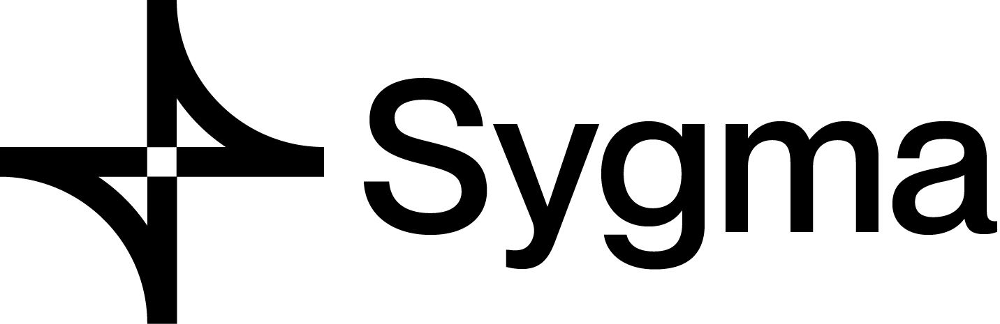

<p align="center"><a href="https://https://chainsafe.io/"></a></p>

# Sygma Explorer UI

This repo contains the our Explorer UI app for checking the data of the tokens transfer for our swap UI.

## Usage

```bash
yarn
yarn start
```

`yarn start` will copy the config file inside the config `folder` to the public folder. This config file is the same file that you use inside the `swap UI` to use it for transferring token.
